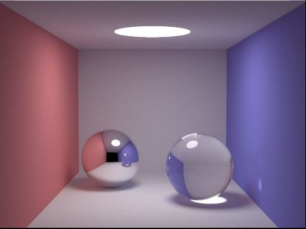

# CPSC 312 Project

# LambdaRays

LambdaRays will be a renderer that creates realistic images using ray tracing, a technique that simulates how light behaves in the real world. By tracing rays from a virtual camera (i.e from a certain perspective), it will render simple shapes with accurate lighting, shadows, and reflections, producing high-quality, detailed graphics. The goal is to have visually appealing images.

This project is in fulfillment of the [CPSC 312 2024W1 project requirements](https://steven-wolfman.github.io/cpsc-312-website-2024W1/project.html).

## Team Members

Our team is:

- Ritvik Joshi (72789472)
- Arman Randhawa (19407006)
- Foram Patel (44089563)

We call ourselves: **The Good, The Bad, The Ugly**.

---
## Acknowledgments

We surely built on the work of others! Here are resources and people we got support from:

- Perplexity helped me a lot on understanding the module system in Haskell as well as the different build tools like Cabal and Stack.
- https://en.wikibooks.org/wiki/Haskell/do_notation: This article helped explain the do notation in haskell, and how <- is syntactic sugar for the bind operator.
- The do notation in Haskell is specifically designed to work with monads.
- https://stackoverflow.com/questions/18174076/raytracing-why-is-my-sphere-rendered-as-an-oval: This forum post helped me understand why I was getting some perspective distortion and how to fix it
- https://www.reddit.com/r/haskell/comments/5ncwvi/my_first_functional_program_in_pure_haskell/: This reddit post helped show me how to get an interactive program running in the terminal with minimal flickering
- https://github.com/ssloy/tinyraytracer/wiki/Part-1:-understandable-raytracing#understandable-raytracing-in-256-lines-of-bare-c: This wiki article gave the initial inspiration and knowledge for tackling a raytracer program


---

## Product Pitch



### **The Problem**

High-fidelity graphics is something the world has been chasing for decades. Computer Graphics are one of the most important things in crafting the presentation of any visual medium that can be simulated on the computer. It ranges from movies, CAD products, simulators, virtual reality, and video games. One of the things that draws people the most to some of these applications is their eye-catching visuals and one way to achieve that is through chasing photo-realistic graphics. The pursuit of photo-realism is one that has been dominated by the ray-tracing paradigm of rendering computer graphics, as it has been show to implement the most realistic visualizations of how we see the world. It has the highest ceiling of any other rendering paradigm out there, and our goal is to explore this paradigm to achieve a renderer that manages to accomplish such feats.

### **The Vision**

LambdaRays provides a realistic offline graphics renderer that uses ray-tracing to produce high-fidelity graphics with realistic shading, great post-processing, support for many types of geometric primitives, and Haskell-specific optimizations. The renderer features

- High resolution ray-traced images supporting 4K images
- Realistic shading supporting diffuse and specular lighting with high-fidelity BRDFs
- Translucent, transparent, and diffuse materials
- Realistic shadowing
- Multiple bounce rays per pixel
- Post-processing support including tone-mapping, bloom, and depth-of-field
- Support for a variety of geometric primitives such as Spheres, Triangles, Quads, etc.
- Paralleization support using Haskell's paralization facilities (e.g. Control.Parallel)

These features will enable LambdaRays to achieve a renderer that is capable of producing very appealing visuals that simulate real-world lighting and optic phenoma, while still being relatively performant due to the ability of our renderer to exploit Haskell's referential transparency guarantee that makes parallelism easy to both accomplish and reason about.

### **Motivation and why this matters to us:**

LambdaRays provides us with an opportunity to explore one of the frontiers in the computer graphics space that is being used in the most realistic animated movies and most-demanding video games on the market right now. It allows to demystify what's truly going on under the hood when we see breathtaking visuals in any computer graphics renderer and have some semblance of an idea of how something so good-looking can be transformed from some raw input to something extraordinary like a realistic city-scape view that is entirely virtual. It also allows us to ponder how we can apply a functional programming paradigm to challenge the state of the art renderers that are being made in imperative languages like C++ today. It perhaps will lead to insights that can be imformative and of significance consequence to any of us later down the line should we find ourselves in the situation of creating a new renderer.

(It's easy to focus on the product and not the problem. Remember to include both!)

---
## Minimal Viable Project

For our MVP, we will focus on the core elements and foundantion of a ray tracer that allows us to render images and scene geometry. The MVP will consist of the following key features:
- **Image Support**: To produce high-fidelity graphics, we must render coloured pixels out into images instead of using terminal based graphics
- **Scene Geometry Primitives**: Our renderer must be able to render scene geometry such as simple primitives like Spheres that can populate our scene
- **Basic shading**: Our renderer should be able to colour and shade our scene objects at a basic level using ambient + their diffuse colour
- **Primitive shadow ray support**: To produce life-like looking renders, we need to have some sense of shadows that geomeotry can cast. Therefore, our renderer should be able support one bounce of shadow rays to get authentic lighting of our scene.

### **How This Builds Toward the Product Pitch**

This MVP is designed to focus on the essential features needed to create a functional raytracer that's capable of producing appealing images. By concentrating on just supporting images, we don't need to concern ourselve by the complexities of real-time graphics with APIs like OpenGL that render using the GPU, yet we still have more complex visuals than what you'd get on the terminal. By adding support for simple scene geometry, we don't need to worry about the complexity of rendering out complicated meshes containing triangles, but we still can render out objects that fill our scene and can demonstrate our renderer's lighting capabilities.

### **How it builds on the strength and power of the language and how it leads naturally to learning and applying some new element of the language (including what that element is!)**

A strength of Haskell is that it lends itself very well to deterministic parallelization due to its functional and pure nature. This is extremely important for graphics rendering because graphics lends itself really well to the SIMD paradigm (each pixel is doing the same operations like MVP transformations). However, with raytracing it's a bit more complicated due to diverging rays that seemingly do different things compared to one another. Despite this, the lack of dependency of each ray on each other still makes it ripe for the picking of the type of paralleziation that Haskell is good at (running it multicore via `Control.Parallel (par, pseq)`), so it would be a nice way to get speed up for high fidelity images that would otherwise be slow on a sequential program.

Another strength of Haskell is of its very expressive type system. With ADTs, Records, type classes, it allows us to have expressive computations involving different mathematical objects like Vectors. One of my main gripes with working on a language like Java and C, is the lack of expressiveness with types. For example, doing vector addition would necessitate going through a `vector_add` method or function which really hurts code consiceness. With Haskell's type classes, you could just implement a Vector as part of the Num type class and get (+),(-), etc. operations for free, significantly improving code conciseness and expressiveness. On top of that, Haskell's strong typing will have help us catch bugs more easier which is all too prevalent (and hard to find) in graphics code, so it's also a very suitable choice here.

---
## Proof of Concept

Our proof-of-concept demonstrates very basic raycasting behaviour, which is one step below ray tracing. It simulates
- Creating a camera https://github.students.cs.ubc.ca/xyzarman/CPSC312-Haskell-Project/blob/main/haskell/src/Lib.hs#L71
- Shooting rays to some virtual image plane per pixel https://github.students.cs.ubc.ca/xyzarman/CPSC312-Haskell-Project/blob/main/haskell/src/Lib.hs#L79
- Testing if rays through the pixels of our virtual image plane intersect with some sphere in the center of our scene. https://github.students.cs.ubc.ca/xyzarman/CPSC312-Haskell-Project/blob/main/haskell/src/Lib.hs#L104
- Interactivity and translating the camera on the X and Y axes https://github.students.cs.ubc.ca/xyzarman/CPSC312-Haskell-Project/blob/main/haskell/app/Main.hs#L8

(Links included on each point above)

### **What key element of your project the proof-of-concept focuses on**
The key element our proof-of-concept focuses on was if we could create rays, distribute them across a screen, test if they can intersect an object, and then draw the results of those tests to some framebuffer (e.g. an array/string)
### **What makes that such an important element**
This is important because it tells us whether the bare principles behind raytracing are fundamentally possible in Haskell, and that everything we do after this essentially builds on top of this foundation. It relies on the idea that we can shoot rays and query them for intersection with any objects, and then draw accordingly to the screen based on that information. Things like proper shading, bounce lighting, etc. all require this to be true.
### **How completing this gives you confidence that, with sufficient work, you could complete the full (minimal viable) project**
After completing the proof-of-concept, we don't have many doubts that we could accomplish the full MVP specifications that we set for ourselves in this project. The hardest changes will be the shift from taking our framebuffer contents and applying them to an image instead of the terminal (no more `putStrLn` but rather a simple PPM image through the HIP library). We think the hardest part will definitely be support for proper shading and shadow rays, however, we think we have the fundamental idea of shooting rays down which will invariably help us with those components.

---
## How to test and run the code: Haskell
**To run the code:**
- cd into the haskell directory
- open VS Code on that directory (code .)
- run the following commands
  -
  - `stack build`
  - `stack run`

**Remarks:**

Running stack run will display a sphere-like shape in your terminal, confined within a square. You can move the sphere using the following keys:
  - w: Move up
  - a: Move left
  - s: Move down
  - d: Move right

As you move the sphere, it represents how the ray focuses on different areas of the screen. For example, moving the sphere up indicates that the ray is focused at the bottom of the screen. Conversely, if the sphere is positioned in the top right corner, it signifies that the ray (or the eye) is looking toward the bottom left corner.

Side Remark: While our MVP will not be interactive, we can use this concept for our proof of concept. The eye of the ray caster will demonstrate that if a user inputs different locations for the eye, the resulting image will vary, as the rays will intersect at different points. This interactivity in our proof of concept is essential for illustrating how our MVP will be.

**Playing around with GHCI:**
If you want to dive deeper using GHCi and not just rely on the terminal to explore the fundamental (bare) ray caster, you can try the following:

- Test Vector Operation:
  ```haskell
  let v1 = Vec3f 1.0 2.0 3.0
  let v2 = Vec3f 4.0 5.0 6.0
  let resultAdd = v1 + v2      -- Addition
  let resultDot = v1 `dot` v2   -- Dot product
  let resultCross = v1 `cross` v2  -- Cross product
  ```
- Create and Test a Sphere
  ```haskell
  let sphere1 = Sphere { position = Vec3f 0.0 0.0 (-5.0), radius = 1.0 }
  let hitTestIntersect = intersect (Vec3f 0.0 0.0 (-1.0)) sphere1 (Vec3f 0.0 0.0 0.0)
  hitTestIntersect   -- Should be True
  ```
  ```haskell
  let sphere2 = Sphere { position = Vec3f 1.0 1.0 (-5.0), radius = 1.0 }
  let hitTestNoIntersect = intersect (Vec3f 0.0 0.0 0.0) sphere2 (Vec3f 0.0 0.0 (-1.0))
  hitTestNoIntersect   -- Should be False
  ```
-  Explore Normalization
    ```haskell
    let normalizedV1 = vecNormalize v1
    let lengthCheck = vecLength normalizedV1
    lengthCheck   -- Should be 1.0
    ```

**To run the Test:**
- cd into the haskell directory
- open VS Code on that directory (code .)
- run the following commands or simply run `make haskell-eval` from the project root
  - `stack build`
  - `stack test`

Core Functionality Tests: Included in our test suite are tests that validate the core functionalities of our ray caster:
- Mathematical Operations:
  - Addition Tests, Subtraction Tests
  - Negation Tests
  - Scalar Multiplication Tests
  - Dot Product Tests, Cross Product Tests
- Linear Algebra Operations
  - Vector Length Tests
  - Vector Distance Tests
  - Normalization Tests
- Ray-Sphere Intersection Tests
  - Hit Case
  - Miss Case
- Edge Case Tests:
  - Zero Vector Addition
  - Zero Vector Normalization
  - Large Vector Normalization
  - Boundary Condition
